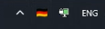

# IpFlags

Небольшое приложение для Windows: показывает флаг страны по вашему IP в системном трее. Иконка обновляется автоматически каждые 30 секунд или по двойному клику / пункту «Update» в меню.

## Скриншоты




## Требования

- Windows
- .NET 8 (или скачайте готовый exe из [Releases](https://github.com/ElvenBless/IpFlags/releases))

## Сборка

Чтобы получить такой же маленький exe (~175 KB), как при публикации через Visual Studio (профиль FolderProfile), нужны **`--self-contained false`** и **`/p:SelfContained=false`**. Без этого SDK может собрать self-contained сборку (~140 MB). Запускайте из **корня репозитория**:

```bash
dotnet publish Src/IpFlags/IpFlags.csproj -c Release -r win-x64 --self-contained false -o Publish /p:SelfContained=false /p:PublishSingleFile=true /p:IncludeNativeLibrariesForSelfExtract=true
```

Готовый файл будет в папке `Publish`. На целевой машине должен быть установлен [.NET 8](https://dotnet.microsoft.com/download/dotnet/8.0).

## Лицензия

MIT